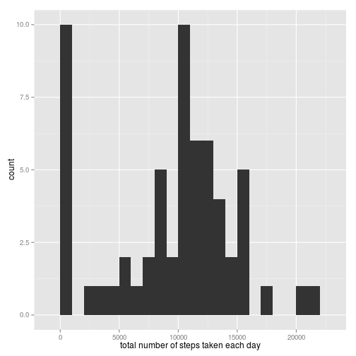

# Reproducible Research: Peer Assessment 1
## Name: Ali Alarafat
## Date: 07 Feb 2015
## Loading and preprocessing the data

```r
unzip(zipfile = "activity.zip")
data <- read.csv("activity.csv")
```


## What is mean total number of steps taken per day?

```r
library(ggplot2)
total.steps <- tapply(data$steps, data$date, FUN = sum, na.rm = TRUE)
qplot(total.steps, binwidth = 1000, xlab = "total number of steps taken each day")
```

 

```r
mean(total.steps, na.rm = TRUE)
```

```
## [1] 9354
```

```r
median(total.steps, na.rm = TRUE)
```

```
## [1] 10395
```


## What is the average daily activity pattern?

```r
library(ggplot2)
averages <- aggregate(x = list(steps = data$steps), by = list(interval = data$interval), 
                      FUN = mean, na.rm = TRUE)
ggplot(data = averages, aes(x = interval, y = steps)) + geom_line() + xlab("5-minute interval") + 
  ylab("average number of steps taken")
```

 


On average across all the days in the dataset, the 5-minute interval contains
the maximum number of steps?

```r
averages[which.max(averages$steps), ]
```

```
##     interval steps
## 104      835 206.2
```


## Imputing missing values

NA values are present in the dataset. These need to be changed to avoid biases in the calculations.


```r
missing <- is.na(data$steps)
# How many missing
table(missing)
```

```
## missing
## FALSE  TRUE 
## 15264  2304
```


The 5-minute interval average is inserted instead of NA value


```r
# Replace each missing value with the mean value of its 5-minute interval
fill.value <- function(steps, interval) {
  filled <- NA
  if (!is.na(steps)) 
    filled <- c(steps) else filled <- (averages[averages$interval == interval, "steps"])
    return(filled)
}
filled.data <- data
filled.data$steps <- mapply(fill.value, filled.data$steps, filled.data$interval)
```

We can start calucating the steps, average, median, etc without being afraid of biases due to NA values.


```r
total.steps <- tapply(filled.data$steps, filled.data$date, FUN = sum)
qplot(total.steps, binwidth = 1000, xlab = "total number of steps taken each day")
```

 

```r
mean(total.steps)
```

```
## [1] 10766
```

```r
median(total.steps)
```

```
## [1] 10766
```


The values of mean and median are higher due to eliminating NA values and replacing them. Days with NA values have 0 steps by default, and we replaced all the NA values, thus we also eliminated the 0 column/row of the histogram.
See figure1 and figure3 for visual explanation of this point.

## Are there differences in activity patterns between weekdays and weekends?
To answer this question we need to separate the measurements into two subsets, weekday and weekend. By doing so we can plot both the subsets and recognize the differences if any.


```r
weekday.or.weekend <- function(date) {
  day <- weekdays(date)
  if (day %in% c("Monday", "Tuesday", "Wednesday", "Thursday", "Friday")) 
    return("weekday") else if (day %in% c("Saturday", "Sunday")) 
      return("weekend") else stop("invalid date")
}
filled.data$date <- as.Date(filled.data$date)
filled.data$day <- sapply(filled.data$date, FUN = weekday.or.weekend)
```


After separting the measurements, now we plot both of the groups

```r
averages <- aggregate(steps ~ interval + day, data = filled.data, mean)
ggplot(averages, aes(interval, steps)) + geom_line() + facet_grid(day ~ .) + 
xlab("5-minute interval") + ylab("Number of steps")
```

 

