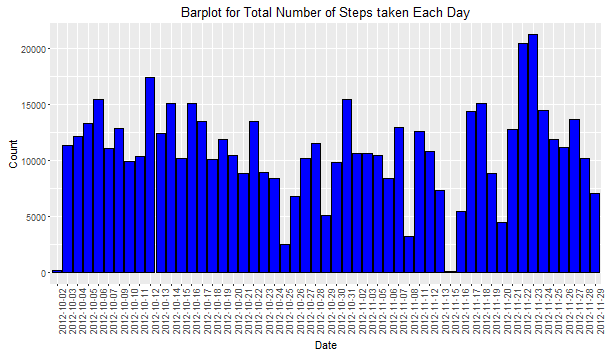
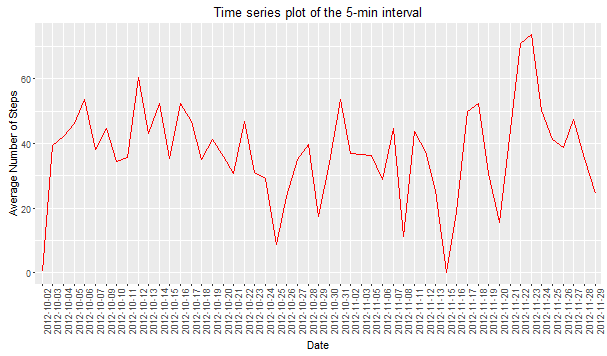
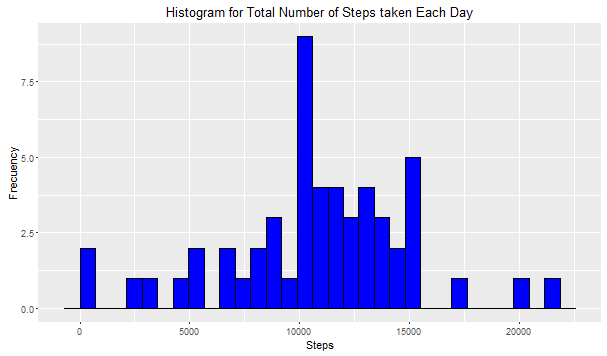
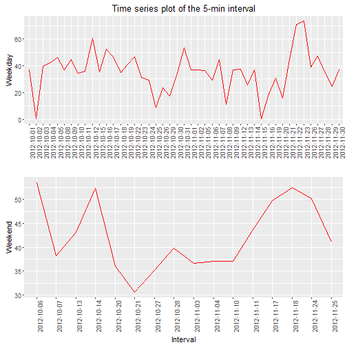

Ali Alarafat
07 Feb 2016
Assignment Course Project 1
============================
**Loading and preprocessing the data**  

1. Load the data (i.e. read.csv())  
        

```r
        activityOrig <- read.csv("activity.csv")
```
2. Process/transform the data (if necessary) into a format suitable for your analysis  

**What is mean total number of steps taken per day?**  

For this part of the assignment, you can ignore the missing values in the dataset.   


```r
        activityNonNA <- activityOrig[complete.cases(activityOrig), ]
```

1. Calculate the total number of steps taken per day


```r
        resultSumNonNA <- aggregate(steps ~ date, activityNonNA, sum)
```

2. Make a histogram and a plot of the total number of steps taken each day to notice the difference between them:


```r
        library(ggplot2)        
```

```
## Want to understand how all the pieces fit together? Buy the
## ggplot2 book: http://ggplot2.org/book/
```

```r
        ggplot(resultSumNonNA, aes(steps)) + 
          geom_histogram(
              col = "red", 
              fill = "green",
              bins = 30) +
              labs(title = "Histogram for Total Number of Steps taken Each Day") +
                      labs(x = "Steps", y = "Frecuency")
```


```r
        ggplot(resultSumNonNA, aes(date, steps)) + 
          geom_bar(
              stat = "identity",
              col = "red", 
              fill = "green") +
              labs(title = "Barplot for Total Number of Steps taken Each Day") +
                      labs(x = "Date", y = "Count") +
          theme(axis.text.x = element_text(angle = 90, hjust = 1))
```



3. Calculate and report the mean and median of the total number of steps taken per day.


```r
        meanNonNA <- mean(activityNonNA$steps)
        medNonNA <- median(activityNonNA$steps)
```

The mean and median are respectively: 37.3825996  and 0 !!!

**What is the average daily activity pattern?**  

1. Make a time series plot (i.e. type = "l") of the 5-minute interval (x-axis) and the average number of steps taken, averaged across all days (y-axis). To calculate the bin size is necessary do: 

        Frecuency: (60 min in one hour / 5 min) * 24 hours per day * (31 days in October + 30 days in November) = 17568 bins of 5 minutes each one.

Made a series time and plotting it.


```r
        resultNonNA <- aggregate(steps ~ date, activityNonNA, mean)
        tsNonNA <- ts(resultNonNA$steps, start = c(2012,10), frequency = 17568)
        ggplot(resultNonNA, aes(date, steps)) +
              labs(title = "Time series plot of the 5-min interval") +
                      labs(x = "Date", y = "Average Number of Steps") +
              theme(axis.text.x = element_text(angle = 90, hjust = 1)) +
          geom_line(aes(group='character'), col = "red") 
```



2. Which 5-minute interval, on average across all the days in the dataset, contains the maximum number of steps?


```r
## Interval
        intervalo <- which(grepl(max(tsNonNA), tsNonNA))
## Value
        value <- round(tsNonNA[intervalo])
```
The maximum is interval: 47 with a value of 74

**Imputing missing values**  

Note that there are a number of days/intervals where there are missing values (coded as NA). 
The presence of missing days may introduce bias into some calculations or summaries of the data.  

1. Calculate and report the total number of missing values in the dataset (i.e. the total number of rows with NAs)


```r
        Original <- nrow(activityOrig)
        Clean <- nrow(activityNonNA)
        valuesNA <- Original - Clean
```
the number of missiong values is 2304.

2. The strategy for filling the missing values in dataset was use the mean of all steps of the data due to some days do not have steps values at all, then it is necessary to implement a simple solution: using a mean of steps of all days of the population.

3. Create a new dataset that is equal to the original dataset but with the missing data filled in.


```r
        ## clone the original dataset that include NA
        activityFillNA <- activityOrig
        ## selecting NA and filled with the mean of all steps
        activityFillNA$steps[which(is.na(activityFillNA$steps))] <- round(mean(activityFillNA$steps, na.rm = TRUE))
```
4. Make a histogram of the total number of steps taken each day and Calculate and report the mean and median 
total number of steps taken per day. Do these values differ from the estimates from the first part of the assignment? What is the impact of imputing missing data on the estimates of the total daily number of steps?


```r
        resultSumFillNA <- aggregate(steps ~ date, activityFillNA, sum)
        ggplot(resultSumFillNA, aes(steps)) + 
          geom_histogram(
              col = "red", 
              fill = "green",
              bins = 30) +
              labs(title = "Histogram for Total Number of Steps taken Each Day") +
                      labs(x = "Steps", y = "Frecuency")
```




```r
        meanFillNA <- mean(activityFillNA$steps)
        medFillNA <- median(activityFillNA$steps)
```
Comparison between mean and median with NA and filling NA. Mean with NA: 37.3324226, 37.3825996, 0, 0.


```r
tabla <- matrix(c(meanFillNA, meanNonNA, medFillNA, medNonNA), ncol = 2, byrow = TRUE)
colnames(tabla) <- c("Filling NA","Without NA")
rownames(tabla) <- c("Mean", "Median")
tabla <- as.table(tabla)
tabla
```

```
##        Filling NA Without NA
## Mean     37.33242   37.38260
## Median    0.00000    0.00000
```

**Are there differences in activity patterns between weekdays and weekends?**

For this part the weekdays() function may be of some help here. Use the dataset with the filled-in 
missing values for this part.    

1. Create a new factor variable in the dataset with two levels - "weekday" and "weekend" indicating 
whether a given date is a weekday or weekend day.


```r
        # clone data with filling NA
        activityDayFillNA <- activityFillNA
        # add new columnn (day) and using the column date populate it with the number of the day [0:6]
        activityDayFillNA$day <- as.POSIXlt(activityDayFillNA$date)$wday
        # change the numeric value of day column with "weekend" and "weekday" depending of its number
        activityDayFillNA$day <- ifelse(activityDayFillNA$day == "0" | activityDayFillNA$day == "6",                                                 activityDayFillNA$day <- "weekend", activityDayFillNA$day <- "weekday")
```

2. Make a panel plot containing a time series plot (i.e. type = "l") of the 5-minute interval (x-axis) 
and the average number of steps taken, averaged across all weekday days or weekend days (y-axis). See 
the README file in the GitHub repository to see an example of what this plot should look like using 
simulated data.

        plot series time
        

```r
        # create two subset of data 
        subSETWeekdays <- subset(activityDayFillNA, activityDayFillNA$day == "weekday")
        subSETWeekend <- subset(activityDayFillNA, activityDayFillNA$day == "weekend")
        # calculate means to the two subsets
        resultMeanWDayFillNA <- aggregate(steps ~ date, subSETWeekdays, mean)
        resultMeanWEndFillNA <- aggregate(steps ~ date, subSETWeekend, mean)
        resultTotal <- merge(resultMeanWDayFillNA, resultMeanWEndFillNA$steps, by = 0, all = TRUE)
```


```r
        library(gridExtra)
        plot1 <- ggplot(resultMeanWDayFillNA, aes(date, steps)) +
              labs(title = "Time series plot of the 5-min interval") +
              labs(x = "", y = "Weekday") +
              theme(axis.text.x = element_text(angle = 90, hjust = 1)) +
            geom_line(aes(group='character'), col = "red") +
            geom_line()
        plot2 <- ggplot(resultMeanWEndFillNA, aes(date, steps)) +
              labs(x = "Interval" , y = "Weekend") +
              theme(axis.text.x = element_text(angle = 90, hjust = 1)) +
            geom_line(aes(group='character'), col = "red")
            grid.arrange(plot1, plot2, ncol= 1)
```

```
## geom_path: Each group consists of only one observation. Do you need to
## adjust the group aesthetic?
```




